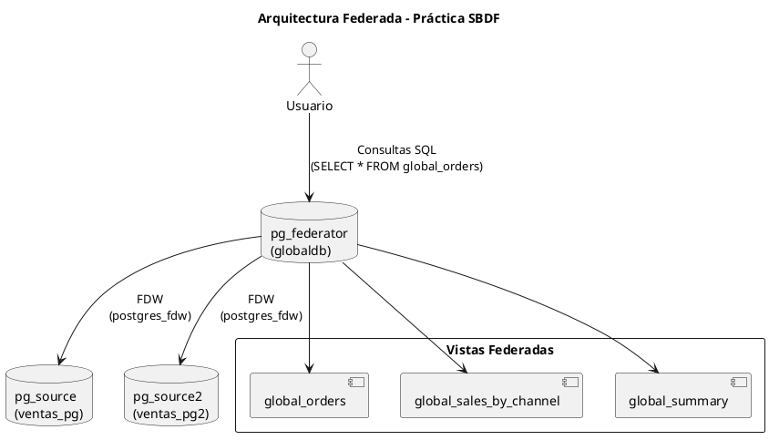

# 🧩 Práctica 1 – Bases de Datos Federadas (SBDF)

Este proyecto implementa un entorno de **bases de datos federadas** utilizando **PostgreSQL** y **Docker**, con el objetivo de integrar información desde múltiples fuentes distribuidas mediante el uso de **Foreign Data Wrappers (FDW)**.

---

## ⚙️ Arquitectura del proyecto

El entorno se compone de **tres contenedores Docker**:

| Servicio | Rol | Puerto | Base de datos | Usuario |
|-----------|-----|---------|----------------|----------|
| `pg_federator` | Servidor federador | 5433 | `globaldb` | `postgres/postgrespass` |
| `pg_source` | Fuente 1 (principal) | 5434 | `ventas_pg` | `srcuser/srcpass` |
| `pg_source2` | Fuente 2 (simula MySQL) | 5435 | `ventas_pg2` | `srcuser2/srcpass2` |

El **federador** conecta con ambas fuentes mediante la extensión `postgres_fdw`, unifica las tablas y permite consultas globales desde una sola vista.

---

## 📁 Estructura del proyecto

```
.
├── docker-compose.yml
├── init
│   ├── federator
│   │   └── 01_enable_fdw.sql
│   ├── pg
│   │   ├── 01_schema.sql
│   │   ├── 02_load.sql
│   │   └── orders_pg.csv
│   └── mysql
│       ├── 01_schema.sql
│       ├── 02_load.sql
│       └── orders_mysql.csv
└── README.md
```

---

## 🚀 Despliegue del entorno

1. Clonar el repositorio:
   ```bash
   git clone https://github.com/tuusuario/practica-bases-datos-federadas.git
   cd practica-bases-datos-federadas
   ```

2. Levantar los contenedores:
   ```bash
   docker compose up -d
   ```

3. Verificar que los contenedores estén activos:
   ```bash
   docker ps
   ```

---

## 🧠 Configuración del federador

Ingresar al contenedor federador:
```bash
docker exec -it pg_federator psql -U postgres -d globaldb
```

Habilitar la extensión FDW:
```sql
CREATE EXTENSION IF NOT EXISTS postgres_fdw;
```

Configurar las conexiones a las dos fuentes:

```sql
-- Fuente 1
CREATE SERVER pg_remote_srv
  FOREIGN DATA WRAPPER postgres_fdw
  OPTIONS (host 'pg_source', dbname 'ventas_pg', port '5432');

CREATE USER MAPPING FOR postgres
  SERVER pg_remote_srv
  OPTIONS (user 'srcuser', password 'srcpass');

IMPORT FOREIGN SCHEMA public
  LIMIT TO (orders_pg)
  FROM SERVER pg_remote_srv INTO public;

-- Fuente 2
CREATE SERVER pg_remote_srv2
  FOREIGN DATA WRAPPER postgres_fdw
  OPTIONS (host 'pg_source2', dbname 'ventas_pg2', port '5432');

CREATE USER MAPPING FOR postgres
  SERVER pg_remote_srv2
  OPTIONS (user 'srcuser2', password 'srcpass2');

IMPORT FOREIGN SCHEMA public
  LIMIT TO (orders_mysql)
  FROM SERVER pg_remote_srv2 INTO public;
```

---

## 🧾 Vistas creadas

Se definieron varias vistas para integrar y analizar los datos federados:

### 1️⃣ `global_orders`
Unifica las órdenes de ambas fuentes:
```sql
CREATE OR REPLACE VIEW global_orders AS
SELECT order_id, customer_id, channel, amount, order_date, 'pg' AS source_system
FROM orders_pg
UNION ALL
SELECT order_id, customer_id, channel, amount, order_date, 'pg2' AS source_system
FROM orders_mysql;
```

### 2️⃣ `global_sales_by_channel`
Ventas totales por canal:
```sql
CREATE OR REPLACE VIEW global_sales_by_channel AS
SELECT channel, SUM(amount) AS total_sales, COUNT(*) AS total_orders
FROM global_orders
GROUP BY channel;
```

### 3️⃣ `global_source_channel`
Volumen de ventas por origen y canal:
```sql
CREATE OR REPLACE VIEW global_source_channel AS
SELECT source_system, channel, COUNT(*) AS total_orders, SUM(amount) AS total_sales
FROM global_orders
GROUP BY source_system, channel
ORDER BY source_system, channel;
```

### 4️⃣ `global_customers`
Clientes únicos combinando todas las fuentes:
```sql
CREATE OR REPLACE VIEW global_customers AS
SELECT DISTINCT customer_id
FROM global_orders;
```

### 5️⃣ `global_summary`
Resumen global de pedidos y ventas:
```sql
CREATE OR REPLACE VIEW global_summary AS
SELECT
  COUNT(*) AS total_orders,
  COUNT(DISTINCT customer_id) AS total_customers,
  SUM(amount) AS total_amount
FROM global_orders;
```

---

## 📊 Consultas de verificación

Validar la integración:
```sql
SELECT source_system, COUNT(*) AS registros, SUM(amount) AS total
FROM global_orders
GROUP BY source_system;
```

Comprobación de clientes y canales:
```sql
SELECT customer_id, SUM(amount) AS total_compras
FROM global_orders
WHERE channel = 'web'
GROUP BY customer_id
ORDER BY total_compras DESC;
```

---

## 🧩 Prueba de independencia de fuentes

Para comprobar la independencia de cada fuente, se detuvo el contenedor `pg_source2`:
```bash
docker stop pg_source2
```
y se ejecutó:
```sql
SELECT * FROM global_orders;
```

El sistema devolvió un error indicando la pérdida de conexión con `pg_source2`, lo que demostró el comportamiento esperado del modelo federado: cuando una fuente está inactiva, las demás permanecen operativas.

---

## 🧭 Diagrama de arquitectura (PlantUML)



Puedes renderizar este diagrama en:  
🔗 [https://www.plantuml.com/plantuml](https://www.plantuml.com/plantuml)

---

## 🧮 Resultados principales

- Integración exitosa de dos fuentes PostgreSQL distribuidas.  
- Ejecución correcta de consultas globales y vistas analíticas.  
- Verificación de independencia y modularidad del modelo.  
- Reproducción completa del entorno mediante Docker.

---

> 💬 *Este proyecto demuestra el uso práctico del modelo federado para la integración lógica de datos distribuidos, aprovechando las capacidades del Foreign Data Wrapper de PostgreSQL.*
